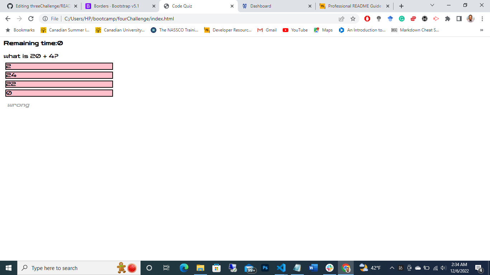

# Code Quiz

## Description

As a coder, one needs to be prepared for the technical interview session which entails speed code test. What better way to prepare for the code test than creating one yourself? This project is to prepare a developer psychologically by understanding what happens behind the scenes when doing your technical interview session. It assists in understanding coding fundamentals and through it one gets to learn how to manage time during tests. 

## Table of Contents

- [Installation](#installation)
- [Usage](#usage)
- [Credits](#credits)
- [License](#license)

## Installation

Just click the following link to view the website https://cheptegei-create.github.io/fourChallenge/

## Usage

When the user loads the website, the user is presented with a landing page outlining the instructions for the code quiz. When the user clicks the start button, then he is presented with a series of questions with choices below each question. When the user clicks on an answer, then a message is presented below the question indicating whether the choice is correct or wrong. After the questions, the user is presented with the final score and an input section to fill the username. After filling the details, the information is stored in the leaderboard which is accessed by pressing the highscore button on the landing page. The time element is linked to the total score, everytime a user gets a question wrong 10s is deducted from the timer. The faster you finish the quiz and the more accurate a user is, the more points gotten on the leaderboard sheet.

## Credits

N/A

## License

Copyright (c) 2020 [David Cheptegei](https://github.com/cheptegei-create)
